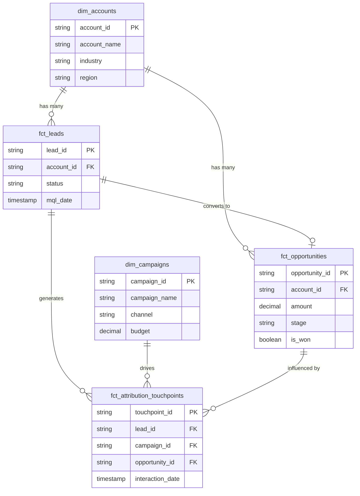

# Entity Relationship Diagram (ERD)

This document visualizes the relationships between the core Silver Layer tables. It uses Mermaid syntax, which is widely used in modern documentation and GitHub.

## Architectural Notes
*   **Star Schema Approach**: The design heavily leans toward a star schema (fact tables surrounded by dimension tables) to optimize for analytical queries and BI tool ingestion.
*   **Attribution Linkage**: The `fct_attribution_touchpoints` table is the critical junction that links Marketing effort (`dim_campaigns`) to Sales outcomes (`fct_opportunities`), enabling multi-touch attribution models.
